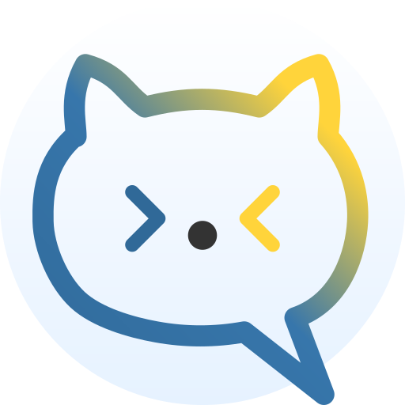
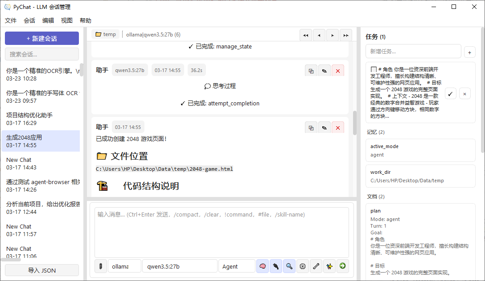
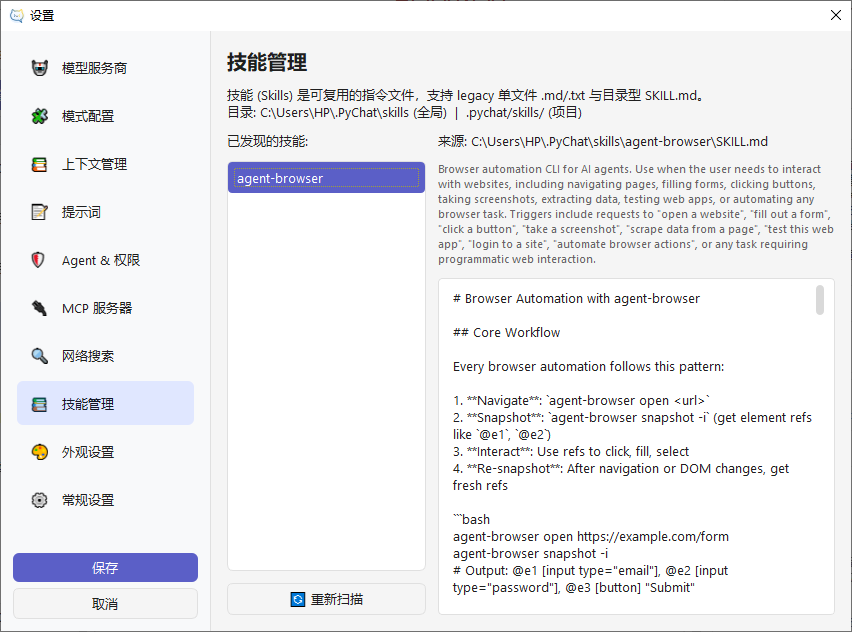

<div align="center">
   

   <h1>PyChat</h1>

   <p><strong>PyChat Agent | LLM chat / agent / tools</strong></p>

   <p>English | <a href="./README_zh.md">简体中文</a></p>

   <p>
      Inspired by desktop AI products such as Cherry Studio and Chatbox,
      PyChat is an all-in-one desktop AI workspace that supports <strong>chat</strong>,
      <strong>agent workflows</strong>, and <strong>tool calling</strong> in one application.
   </p>

   <p>
      <a href="./ARCHITECTURE.md">Architecture</a> ·
      <a href="./docs/PLAN_AGENT_RUNTIME_REFACTOR.md">Runtime Refactor</a> ·
      <a href="./docs/ARCHITECTURE_REDESIGN.md">Architecture Redesign</a> ·
      <a href="./requirements.txt">Requirements</a>
   </p>
</div>

<div align="center">
      
      
      
      
      
</div>

## ✨ Overview

PyChat Agent is a desktop-first AI client that brings LLM chat, agent workflows, and tool orchestration into a single PyQt6 application while keeping the flexibility and maintainability of a Python codebase.

It is especially suitable for the following scenarios:

- Manage multiple model providers in one interface.
- Combine chat, agent, and tools in one desktop workflow.
- Keep long conversations, tasks, and context flows organized.
- Extend AI capabilities with MCP, skills files, and mode configuration.

## 🖼️ Screenshots

<table>
   <tr>
      <td align="center" width="68%">
         
         <br />
         <sub><strong>Main window</strong>: conversation list, message flow, and task / memory / document panels in one workspace</sub>
      </td>
      <td align="center" width="32%">
         
         <br />
         <sub><strong>Settings</strong>: providers, modes, MCP, web search, and skills management</sub>
      </td>
   </tr>
</table>

## 🌟 Highlights

| Area | Description |
| --- | --- |
| Chat / Agent / Tools | Unifies classic chat, autonomous agent execution, and tool calling in one desktop workflow. |
| Multi-provider support | Supports OpenAI, Claude (Anthropic), Ollama, Google Gemini, DeepSeek, and other API / protocol integrations. |
| Deep-thinking rendering | Automatically parses and renders `<think>` / `<analysis>` tags with streaming-friendly display. |
| Conversation & context management | Supports import / export, message editing, branch handling, image upload, and multimodal interaction. |
| MCP / Skills extensibility | Native support for Model Context Protocol, local tools, search services, and reusable skills files. |
| Modern desktop UX | Includes dark / light themes, high-DPI support, a conversation tree sidebar, and a clean information layout. |
| Performance observability | Displays token throughput (Tokens/sec) and response time in real time. |

## 🧩 Feature Overview

### Multi-model conversation workflow

- Unified access to mainstream cloud and local models.
- Shared UX for chat, agent, and tools instead of splitting them into separate apps.
- Conversation management optimized for desktop usage.
- Suitable for chat, writing, analysis, and coding assistance.

### Extensibility

- **MCP server configuration**: connect external tools or services through `stdio`.
- **Skills system**: reusable instruction files for capabilities such as browser automation.
- **Mode configuration**: switch runtime modes or policies for different tasks.

### Data and rendering

- Supports multiple conversation import formats.
- Clear rendering for Markdown, code blocks, and structured content.
- Styles are stored in `assets/styles/` for further UI customization.

## 🏗️ Architecture

The project follows a layered architecture for maintainability and future refactoring:

- **`ui/`**: presentation layer for windows, widgets, input collection, and interaction forwarding.
- **`core/`**: runtime core for command dispatching, task loops, prompt assembly, skills, attachments, and context building.
- **`services/`**: application services for persistence, provider management, search, and MCP orchestration.
- **`models/`**: data models such as Conversation, Provider, and State.
- **`utils/`**: general-purpose utilities with minimal business coupling.

See also:

- [`ARCHITECTURE.md`](./ARCHITECTURE.md)
- [`docs/PLAN_AGENT_RUNTIME_REFACTOR.md`](./docs/PLAN_AGENT_RUNTIME_REFACTOR.md)
- [`docs/ARCHITECTURE_REDESIGN.md`](./docs/ARCHITECTURE_REDESIGN.md)

## 🚀 Quick Start

### Requirements

- Python 3.9+
- Windows / macOS / Linux

### Install and run

```bash
git clone <repository-url>
cd pychat
python -m venv .venv

# Windows
.venv\Scripts\activate

# macOS / Linux
source .venv/bin/activate

pip install -r requirements.txt
python main.py
```

If you just want to try it quickly, the happy path is straightforward: install dependencies and run `python main.py`.

## 🛠️ Build for Windows (Nuitka)

To generate a standalone Windows build and a zip package with Nuitka:

```powershell
python -m pip install -r requirements.txt
python -m pip install nuitka ordered-set zstandard
powershell -ExecutionPolicy Bypass -File .\build_nuitka.ps1
```

The build script will:

- compile a standalone Windows distribution with Nuitka,
- bundle `assets/`, `pycat.ico`, `LICENSE`, `README.md`, and `README_zh.md`,
- generate a zip archive named `PyChat-Agent-windows-x64.zip` in the project root.

## 📁 Project Structure

```text
pychat/
├─ assets/        # icons, screenshots, style assets
├─ core/          # runtime core logic
├─ docs/          # design docs and refactor plans
├─ models/        # data models
├─ services/      # application services and integrations
├─ tests/         # test code
├─ ui/            # user interface layer
├─ utils/         # shared utilities
└─ main.py        # application entry point
```

## ⚙️ Notes

### MCP server configuration

You can add MCP servers from the settings page. PyChat communicates with MCP services through `stdio`, allowing web search, local file operations, and other external tools to be integrated into the conversation workflow.

### Conversation import

PyChat currently supports multiple import formats, including:

- **ChatGPT Export**: import official exported JSON bundles.
- **OpenAI Payload**: create conversations from API request payloads.
- **Conversation JSON**: project-specific backup format.

### Style customization

UI styles are mainly located in `assets/styles/`. If you want to move closer to a Cherry Studio-inspired look or build your own branded appearance, this is where the fun starts.

## 🤝 Contributing

Contributions are welcome. Before submitting changes, it helps to understand the current layering rules:

1. Follow the layering rules and avoid reverse dependencies.
2. When adding a provider, prefer extending request-building logic under `services/llm/`.
3. Keep the `models/` layer pure and free from UI or I/O dependencies.
4. Update related design documents when changing runtime or architecture behavior.

If you are about to dive in, reading `ARCHITECTURE.md` first will save you from a surprising number of potholes.

## 📜 License

PyChat is licensed under the GNU Affero General Public License v3.0 (AGPL-3.0).

Commercial use is permitted, provided that all AGPL-3.0 obligations are fully satisfied.

See [`LICENSE`](./LICENSE) for the full license text.

